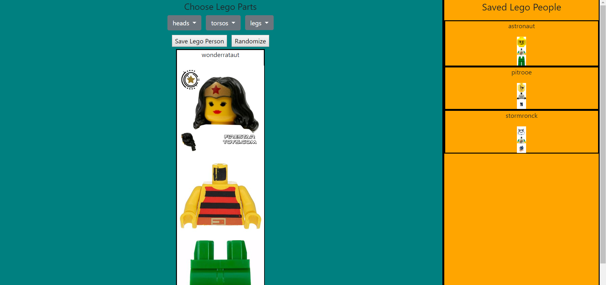

## Lego Peoples Maker
This program lets you create a lego person from a small list of lego heads, torsos, and legs.  You can save your lego people into a list displayed on the side for later viewing.  You can also randomize your lego person's look.  

### Screenshots

### How to run this app

1.  Serve up the app
* At the root of the project: `npm install`
* In a seperate terminal `npm run legos` to run the JSON server
* `npm start` to run a hot updated build
* `npm build` to create a distribution